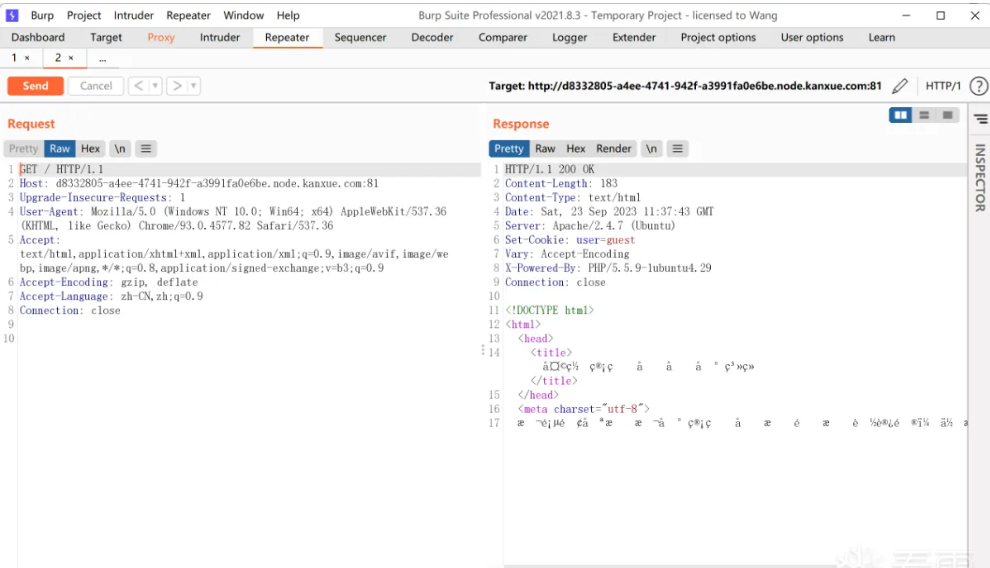

## 题目简介

30世纪，人工智能AI发展速度远超人类预期，逐渐开始有了意识。由于人类对AI的依赖程度越来越强，滥用各种AI技术，导致这种依赖逐渐演变为了一种“威胁”，它们开始不听人类指挥，悄悄组成“智能联盟”，建立了一个AI母体系统想方设法取代人类。你，杰克和詹姆斯高智商的脑力算法工程师，团队作战，你们三人被派遣前去攻击AI母体系统，获得最终的控制权。在这期间，你们将会遇到各种各样的困难.......最终你们成功完成任务，也正式由于此件事情，人类开始思考“如何与AI更好地共存”.......

比赛结束后若需要练习，请直接访问此链接：
http://kctf.kanxue.com/challenges#KCTF2023_%E7%AD%BE%E5%88%B0%E9%A2%98-190-8

## 题解

抓包

修改cookie中user的值，和绕过本地

