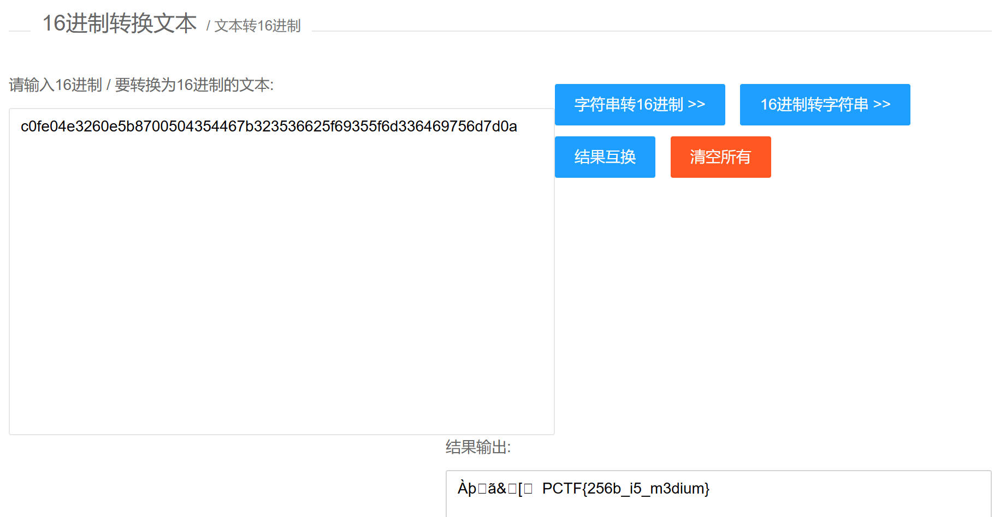

# 密码学

## 古典密码学

### 1. 轮转机加密

题面：

1:  < ZWAXJGDLUBVIQHKYPNTCRMOSFE <
2:  < KPBELNACZDTRXMJQOYHGVSFUWI <
3:  < BDMAIZVRNSJUWFHTEQGYXPLOCK <
4:  < RPLNDVHGFCUKTEBSXQYIZMJWAO <
5:  < IHFRLABEUOTSGJVDKCPMNZQWXY <
6:  < AMKGHIWPNYCJBFZDRUSLOQXVET <
7:  < GWTHSPYBXIZULVKMRAFDCEONJQ <
8:  < NOZUTWDCVRJLXKISEFAPMYGHBQ <
9:  < XPLTDSRFHENYVUBMCQWAOIKZGJ <
10: < UDNAJFBOWTGVRSCZQKELMXYIHP <
11： < MNBVCXZQWERTPOIUYALSKDJFHG <
12： < LVNCMXZPQOWEIURYTASBKJDFHG <
13： < JZQAWSXCDERFVBGTYHNUMKILOP <

密钥为：2,3,7,5,13,12,9,1,8,10,4,11,6
密文为：NFQKSEVOQOFNP

题解：

加密原理：首先需要一组带有标号的轮（从1号轮，2号轮...，n号轮），然后在这些轮的边缘刻有随机化的26个英文字母。最后在解密时，先要根据密钥将这组轮按顺序由上到下排列，再根据密文从上到下转动轮，直到可以从这个轮转机中读出密文，那么这时候明文一定也解密出来了，我们只需要一列一列的寻找可能的明文。

使用python脚本进行题解：

```python
original_wheel = ['ZWAXJGDLUBVIQHKYPNTCRMOSFE',
                  'PBELNACZDTRXMJQOYHGVSFUWI',
                  'BDMAIZVRNSJUWFHTEQGYXPLOCK',
                  'RPLNDVHGFCUKTEBSXQYIZMJWAO',
                  'IHFRLABEUOTSGJVDKCPMNZQWXY',
                  'AMKGHIWPNYCJBFZDRUSLOQXVET',
                  'GWTHSPYBXIZULVKMRAFDCEONJQ',
                  'NOZUTWDCVRJLXKISEFAPMYGHBQ',
                  'XPLTDSRFHENYVUBMCQWAOIKZGJ',
                  'UDNAJFBOWTGVRSCZQKELMXYIHP',
                  'MNBVCXZQWERTPOIUYALSKDJFHG',
                  'LVNCMXZPQOWEIURYTASBKJDFHG',
                  'JZQAWSXCDERFVBGTYHNUMKILOP ']#所给初始状态的轮转机
shifted_wheel = []
key = [2,3,7,5,13,12,9,1,8,10,4,11,6] #所给密钥
ciphertext = 'NFQKSEVOQOFNP' #所给密文
 
#按照密钥顺序对轮排序
for i in key:
    shifted_wheel.append(original_wheel[i-1])
print('按照密钥重新排序后的轮转机：\n',shifted_wheel)
 
#按照密文顺序转动轮
for i in range(len(shifted_wheel)):
    index = shifted_wheel[i].index(ciphertext[i])
    shifted_wheel[i] = shifted_wheel[i][index:]+shifted_wheel[i][0:index]
print('按照密文重新排序后的轮转机：\n',shifted_wheel)
 
#读取所有恢复的明文
print('输出所有可能的明文：')
for i in range(1,len(shifted_wheel[0])):
    for j in range(len(shifted_wheel)):
        print(shifted_wheel[j][i],end=' ')
    print()
```

解得答案为 `FIREINTHEHOLE`.

### 2. 诗歌密码

题面：

```text
The life that I have
Is all that I have
And the life that I have
Is yours.

The love that I have
Of the life that I have
Is yours and yours and yours.

A sleep I shall have
A rest I shall have
Yet death will be but a pause.

For the peace of my years
In the long green grass
Will be yours and yours and yours.

decrypted message: emzcf sebt yuwi ytrr ortl rbon aluo konf ihye cyog rowh prhj feom ihos perp twnb tpak heoc yaui usoa irtd tnlu ntke onds goym hmpq
```

题解：

1. 给出一首诗歌
for my purpose holds to sail beyond the sunset, and the baths of all the western stars until I die.
2. 给出5个关键单词。
“for”, “sail”, “all”, “stars”, “die.”
对其进行拆散：
f o r s a i l a l l s t a r s d i e
接下来按照 字母表顺序 进行编号，若遇相同字母，则继续 +1
3. 将要传递的消息进行加密。
We have run out of cigars, situation desperate。
先对其进行编码。因为给出的5个关键词，其长度为18.所以以18为一组。
若一组长度不满18，则用abc(不要求有序)进行补充。
4. 将排好的消息，按照之前给出的诗歌字母编号写下密文。
for my purpose holds to sail beyond the sunset, and the baths of all the western stars until I die.
如， for --> eud tdk oek 那么得到的又可以按照5个（适当个数）为一组进行重新分组，得到最后密文。

解得密码为：`ifyouthinkcryptographyistheanswertoyourproblemthenyoudonotknowwhatyourproblemisabcdefghijklmnopqrstu`

## 现代密码学

### 1. Easy_RSA

题面：


题解：

RSA算法的步骤：
- 任选两个大质数 $p$ 和 $q$，$p\ !=q$，计算 $N=pq$
- 计算 $N$ 的欧拉函数 $r(n)=(p-1)(q-1)$ 
- 任选一个 $e$ 满足 $1 <e <r(n)$，且 $e$ 与 $r(n)$ 互质
- 找到 $d$ ，使 $e*d/r(n)=x……1$（x是多少不重要，重要的是余数为1）

至此，$(n, e)$ 为公钥，$(n, d)$ 为私钥。
加密：$C = M ^ {(e\ mod\ n)}$；解密：$M = C ^ {(d\ mod\ n)}$
$e * d mod Φ(n) === 1$ -> $d=(k(q-1)(p-1)+1)/e$

所以，d的求解过程是 $d=((q-1)(p-1)+1)/e=((473398607161-1)*(4511491-1)+1)/17$

使用Python计算这个过程：

```python
import numpy as np
np.set_printoptions(suppress=True) #取消科学计数法
p=473398607161
q=4511491
n=(q-1)*(p-1)
e=17
k=1
while 1:
   if ((n*k)+1)%e==0:
        d=(n*k+1)/e
        print(d)
        break
    k+=1
```

解得答案为 `125631357777427553`.

### 2. Normal_RSA

题面：

flag.enc 是经过 rsa 加密后的密文, pubkey.pem 是 rsa 的公钥文件


打开 pubkey.pem :
```
-----BEGIN PUBLIC KEY-----
MDwwDQYJKoZIhvcNAQEBBQADKwAwKAIhAMJjauXD2OQ/+5erCQKPGqxsC/bNPXDr
yigb/+l/vjDdAgMBAAE=
-----END PUBLIC KEY-----
```

将该内容放到RSA网站上解密：


得到 
`n = 87924348264132406875276140514499937145050893665602592992418171647042491658461`
`e = 65537`
对n进行质因数分解：
`p1 = 319576316814478949870590164193048041239`
`p2 = 275127860351348928173285174381581152299`
然后在计算n的欧拉函数 $φ(n) = (p1-1)*(p2-1)$
`φ(n) = 87924348264132406875276140514499937144456189488436765114374296308467862464924`
在计算 e 模 φ(n) 的逆元 d
得到 $d = 10866948760844599168252082612378495977388271279679231539839049698621994994673$
用十六进制打开密文文件得到：
c = 0x6d3eb7df23eee1d38710beba78a0878e0e9c65bd3d08496dda64924199110c79
根据 $m=c^d\ mod\ n$
计算得到 m = 0x2c0fe04e3260e5b8700504354467b323536625f69355f6d336469756d7d0aL
16进制转换字符串得：


### 3. Easy_Crypto

题面：

```text
get buf unsign s[256]

get buf t[256]

we have key:hello world

we have flag:????????????????????????????????


for i:0 to 256
    
set s[i]:i

for i:0 to 256
    set t[i]:key[(i)mod(key.lenth)]

for i:0 to 256
    set j:(j+s[i]+t[i])mod(256)
        swap:s[i],s[j]

for m:0 to 37
    set i:(i + 1)mod(256)
    set j:(j + S[i])mod(256)
    swap:s[i],s[j]
    set x:(s[i] + (s[j]mod(256))mod(256))
    set flag[m]:flag[m]^s[x]

fprint flagx to file
```

这段伪代码描述了一个类似于RC4加密算法的过程。RC4是一种流加密算法，通过将一个密钥流与明文进行运算来加密数据。
可以看出加密操作是异或过程。所以再用一次异或即可解出明文。

参照伪代码写出代码如下：

```python
s = list(range(256))
t = []
key = "hello world"

for i in range(256):
    t.append(key[i % len(key)]) # fill t with key (by circle)
print(t)

j = 0
for i in range(256):
    j = (j + s[i] + ord(t[i])) % 256
    s[i], s[j] = s[j], s[i]
print(s)

c = open("F:\\ChromeCommon\\enc\\enc.txt","rb").read()
i = 0
j = 0
flag = ""
for ci in c:
    i = (i + 1) % 256
    j = (j + s[i]) % 256
    s[i], s[j] = s[j], s[i]
    x = (s[i] + (s[j] % 256)) % 256
    flag += chr(ci ^ s[x])
print(flag)
```

解得答案为：`EIS{55a0a84f86a6ad40006f014619577ad3}`

### 4. 流量分析

题面：

不久前，运维人员在日常安全检查的时候发现现场某设备会不时向某不知名ip发出非正常的ICMP PING包。
这引起了运维人员的注意，他在过滤出ICMP包分析并马上开始做应急处理很可能已被攻击的设备。运维人员到底发现了什么? flag形式为 flag{}

题解：

流量分析的基本方法有：
binwalk、查找一些可疑字符串或16进制数据，排序流量包的长度(最长的流量包一般很可疑)；

当我们对流量包的长度进行排序时，发现流量包最短90字节，最长也不过164字节，
其中的data段数据长度从48到122，而ascii表中第48至122个字符为0123456789:;<=>?@ABCDEFGHIJKLMNOPQRSTUVWXYZ[\]^_`abcdefghijklmnopqrstuvwxyz，
于是将每个流量包的长度转换为对应字符，然后连接成一段长字符串，看上去像base64编码，对字符串进行base64解码即可。

```python
from pyshark.capture.file_capture import FileCapture
from base64 import b64decode
from sys import argv

def solve(file_name):
    packets=FileCapture(input_file=file_name)
    res=''
    for packet in packets:
        for pkt in packet:
            if pkt.layer_name=='icmp' and int(pkt.type,16):
                res+=chr(int(pkt.data_len))
    return b64decode(res)

if __name__=='__main__':
    print solve(argv[1])
```

解得答案：FLAG{xx2b8a_6mm64c_fsociety}

### 5. OneTimePad

题面：

```python
#!/usr/bin/env python
# coding=utf-8

from os import urandom

def process(m, k):
    tmp = m ^ k
    res = 0
    for i in bin(tmp)[2:]:
        res = res << 1;
        if (int(i)):
            res = res ^ tmp
        if (res >> 256):
            res = res ^ P
    return res

def keygen(seed):
    key = str2num(urandom(32))
    while True:
        yield key
        key = process(key, seed)

def str2num(s):
    return int(s.encode('hex'), 16)

P = 0x10000000000000000000000000000000000000000000000000000000000000425L

true_secret = open('flag.txt').read()[:32]
assert len(true_secret) == 32
print 'flag{%s}' % true_secret
fake_secret1 = "I_am_not_a_secret_so_you_know_me"
fake_secret2 = "feeddeadbeefcafefeeddeadbeefcafe"
secret = str2num(urandom(32))

generator = keygen(secret)
ctxt1 = hex(str2num(true_secret) ^ generator.next())[2:-1]
ctxt2 = hex(str2num(fake_secret1) ^ generator.next())[2:-1]
ctxt3 = hex(str2num(fake_secret2) ^ generator.next())[2:-1]
f = open('ciphertext', 'w')
f.write(ctxt1+'\n')
f.write(ctxt2+'\n')
f.write(ctxt3+'\n')
f.close()
```

```text
af3fcc28377e7e983355096fd4f635856df82bbab61d2c50892d9ee5d913a07f
630eb4dce274d29a16f86940f2f35253477665949170ed9e8c9e828794b5543c
e913db07cbe4f433c7cdeaac549757d23651ebdccf69d7fbdfd5dc2829334d1b
```

题解：

这是一种自定义的加密方式，通过阅读`process()`函数，可以看出加密方式：
- m 和 k 是两个整数。
- 计算 tmp 为 m 和 k 的异或。
- 将 res 初始化为 0。
- 遍历 tmp 的二进制表示形式中的每一位。
- 将 res 左移 1 位。
- 如果该位为 1，则将 res 与 tmp 异或。
- 如果 res 超过 256 位，则将 res 与预定义的常量 P 异或。
- 返回 res 的最终值。


$k_2 = (k_1 + secret)^2, k_3 = (k_2 + secret)^2$

$c_1 = m_1 \oplus k_1, c_2 = m_2 \oplus k_2, c_3 = m_3 \oplus k_3, \text{ 其中 } c_i (i = 1, 2, 3), m_i (i = 1, 2) \text{已知}$

则 $k_2 = m_2 \oplus c_2$, $k_3 = m_3 \oplus c_3$, 可解出 $secret = k_3^{1/2} + k_2$

接下来解出 $ k_1: k_1 = k_2^{1/2} + secret$

然后解出 $flag(即 m_1): m_1 = c_1 \oplus k_1 $

逆向写出代码，解出密码：

```python
from Crypto.Util.number import bytes_to_long,long_to_bytes

K.<x>=GF(2L**256,modulus=x^256+x^10+x^5+x^2+1)

def polify(N):
    bN=list(bin(N)[2:])
    bN.reverse()
    return K(bN)

def unpolify(Poly):
    bN=Poly.polynomial().list()
    bN.reverse()
    return long(''.join([str(it) for it in bN]),2)

def solve():
    cip1=polify(0xaf3fcc28377e7e983355096fd4f635856df82bbab61d2c50892d9ee5d913a07f)
    cip2=polify(0x630eb4dce274d29a16f86940f2f35253477665949170ed9e8c9e828794b5543c)
    cip3=polify(0xe913db07cbe4f433c7cdeaac549757d23651ebdccf69d7fbdfd5dc2829334d1b)
    msg2=polify(bytes_to_long('I_am_not_a_secret_so_you_know_me'))
    msg3=polify(bytes_to_long('feeddeadbeefcafefeeddeadbeefcafe'))
    secret=cip2+msg2+(cip3+msg3).sqrt()
    key1=(cip2+msg2).sqrt()+secret
    msg1=cip1+key1
    return long_to_bytes(unpolify(msg1))

if __name__=='__main__':
    print 'flag{'+solve()+'}'
```

密码：`flag{t0_B3_r4ndoM_en0Ugh_1s_nec3s5arY}`

### 6. AES

题面：

```python
from Crypto.Util.number import getPrime,long_to_bytes,bytes_to_long
from Crypto.Cipher import AES
import hashlib
from random import randint
def gen512num():
    order=[]
    while len(order)!=512:
        tmp=randint(1,512)
        if tmp not in order:
            order.append(tmp)
    ps=[]
    for i in range(512):
        p=getPrime(512-order[i]+10)
        pre=bin(p)[2:][0:(512-order[i])]+"1"
        ps.append(int(pre+"0"*(512-len(pre)),2))
    return ps

def run():
    choose=getPrime(512)
    ps=gen512num()
    print "gen over"
    bchoose=bin(choose)[2:]
    r=0
    bchoose = "0"*(512-len(bchoose))+bchoose
    for i in range(512):
        if bchoose[i]=='1':
            r=r^ps[i]
    flag=open("flag","r").read()

    key=long_to_bytes(int(hashlib.md5(long_to_bytes(choose)).hexdigest(),16))
    aes_obj = AES.new(key, AES.MODE_ECB)
    ef=aes_obj.encrypt(flag).encode("base64")

    open("r", "w").write(str(r))
    open("ef","w").write(ef)
    gg=""
    for p in ps:
        gg+=str(p)+"\n"
    open("ps","w").write(gg)

run()
```

根据代码可以知道解题的思路是先由ps与r解出bchoose，再由bchoose按照同样的过程计算key，
最后进行AES解密求出flag。

```python
r=0
for i in range(512):
    if bchoose[i]=='1':
        r=r^ps[i]
```

即$ r=\sum_{i=1}^{512} \text { bchoose }[\mathrm{i}] \cdot \mathrm{ps}[\mathrm{i}] $(此处的加法是异或)
虽然生成方式类似背包加密，但是由于ps具有很好的性质，我们不使用破解背包加密的方法来解此题；我们来分析生成ps的gen512num函数：

```python
def gen512num():
    order=[]
    while len(order)!=512:
        tmp=randint(1,512)
        if tmp not in order:
            order.append(tmp)
    ps=[]
    for i in range(512):
        p=getPrime(512-order[i]+10)
        pre=bin(p)[2:][0:(512-order[i])]+"1"
        ps.append(int(pre+"0"*(512-len(pre)),2))
    return ps
```

order 是 $1,2,...,512$ 的一个随机的排列列，对 $ps[i]$ :首先生成一个长度为 $512-order[i]+10$ 的素数，去掉此素数的最后10位，同时在尾部追加一个二进制位1，最后在后面填充0使得长度为512；
我们首先考虑生成的最后1个二进制位，ps中只有1个数最后1位为1，其余数最后1位均为0，那么最后1位为1的数如果没有“加入”异或运算，那么r的最后1位一定为0，否则，一定为1，
这样我们通过的最后1位就可以推断出 $bchoose$ 的第j位(记 $order[i]=1$)。接下来，$r ⊕ (bchoose[j] · ps[j]) = Σ_{i ≠ j} bchoose[i] · ps[i]$，在 ${ps[i] | i ≠ j}$ 中，只有1个数倒数第2位为1，
同理，可推断出bchoose的第k位(记 $order[k]=2$ )，直至推断出bchoose所有位。

```python
from base64 import b64decode
from hashlib import md5
from Crypto.Cipher import AES
from Crypto.Util.number import long_to_bytes

def cal_k():
    with open('ps','r') as f:
        ps=[long(x) for x in f.read().split('\n')[:-1]]
    with open('r','r') as f:
        r=long(f.read())
    pbits=[bin(x).rfind('1')-2 for x in ps]
    bc=['0']*512
    for le in range(512):
        ind=pbits.index(511-le)
        tt=bin(r)[2:].rjust(512,'0')[511-le]
        if tt=='1':
            bc[ind]='1'
            r^=ps[ind]
    return long(''.join(bc),2)

def solve():
    with open('ef','rb') as f:
        ef=b64decode(f.read())
    key=long_to_bytes(int(md5(long_to_bytes(cal_k())).hexdigest(),16))
    aes_obj = AES.new(key, AES.MODE_ECB)
    return aes_obj.decrypt(ef)

if __name__=='__main__':
    print solve()
```

解得密码为：`flag{shemir_alotof_in_wctf_fun!}`

