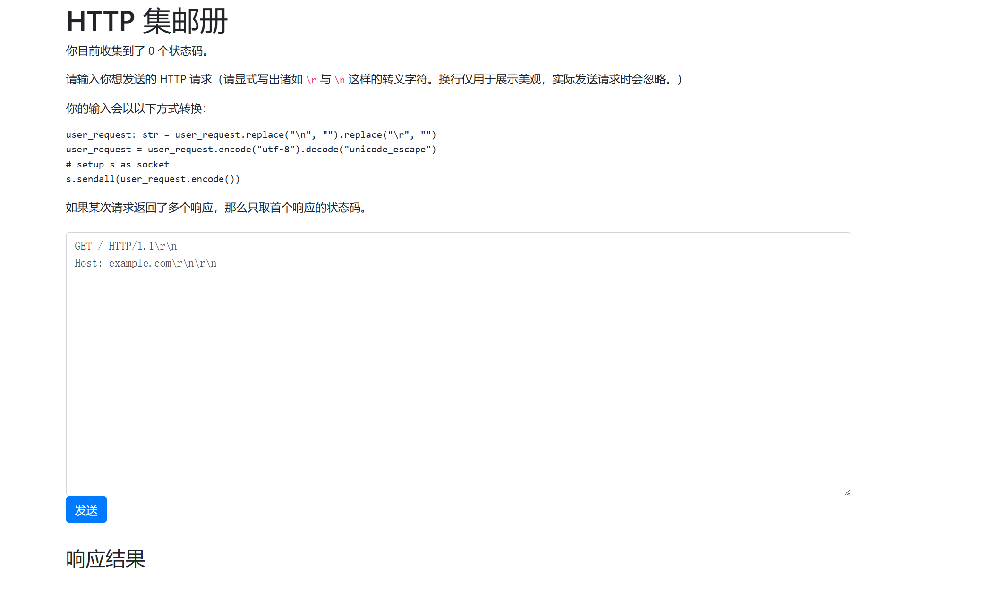

HTTP 集邮册
```
「HTTP 请求一瞬间就得到了响应，但是，HTTP 响应的 status line、header 和 body 都是确实存在的。如果将一个一个 HTTP 状态码收集起来，也许就能变成……变成……变成……」

「flag？」

「就能变成 flag！」
```
本题中，你可以向一个 nginx 服务器（对应的容器为默认配置下的 nginx:1.25.2-bookworm）发送 HTTP 请求。你需要获取到不同的 HTTP 响应状态码以获取 flag，其中：

获取第一个 flag 需要收集 5 种状态码；
获取第二个 flag 需要让 nginx 返回首行无状态码的响应（不计入收集的状态码中）；
获取第三个 flag 需要收集 12 种状态码。
关于无状态码的判断逻辑如下：

```
crlf = buf.find(b"\r\n")
if buf.strip() != b"":
    try:
        if crlf == -1:
            raise ValueError("No CRLF found")
        status_line = buf[:crlf]
        http_version, status_code, reason_phrase = status_line.split(b" ", 2)
        status_code = int(status_code)
    except ValueError:
        buf += "（无状态码）".encode()
        status_code = None
```




```html
GET / HTTP/1.1\r\n
Host: example.com\r\n\r\n

响应结果
HTTP/1.1 200 OK
```


```html
GET / HTTP/2\r\n
Host: example.com\r\n\r\n


响应结果
HTTP/1.1 505 HTTP Version Not Supported
```


```
PUT/ HTTP/1.1\r\n
Host: example.com\r\n\r\n


响应结果
HTTP/1.1 400 Bad Request
```


```
PUT /index HTTP/1.1\r\n
Host: example.com\r\n\r\n


响应结果
HTTP/1.1 405 Not Allowed
```


```
GET /index.php HTTP/1.1\r\n
Host: example.com\r\n\r\n


响应结果
HTTP/1.1 404 Not Found
```


```
GET /index.index.htmli.......中间超长数据.........x.index.htmlindex.index.htmlindex.index.html HTTP/1.1\r\n
host: example.com\r\n\r\n


响应结果
HTTP/1.1 414 Request-URI Too Large
```


### 2. 无状态码

**请求为**

```http
POST /HTTP/1.1\r\nHost: examasple.co\n\r\n\r
```

**即可因为异常而返回结果**

