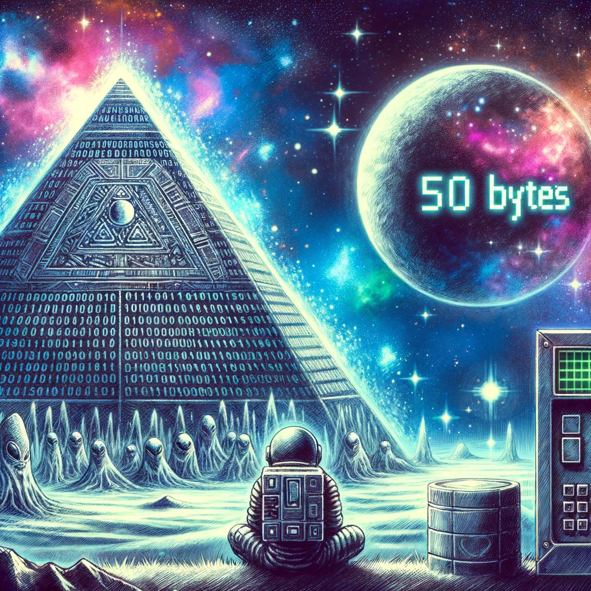
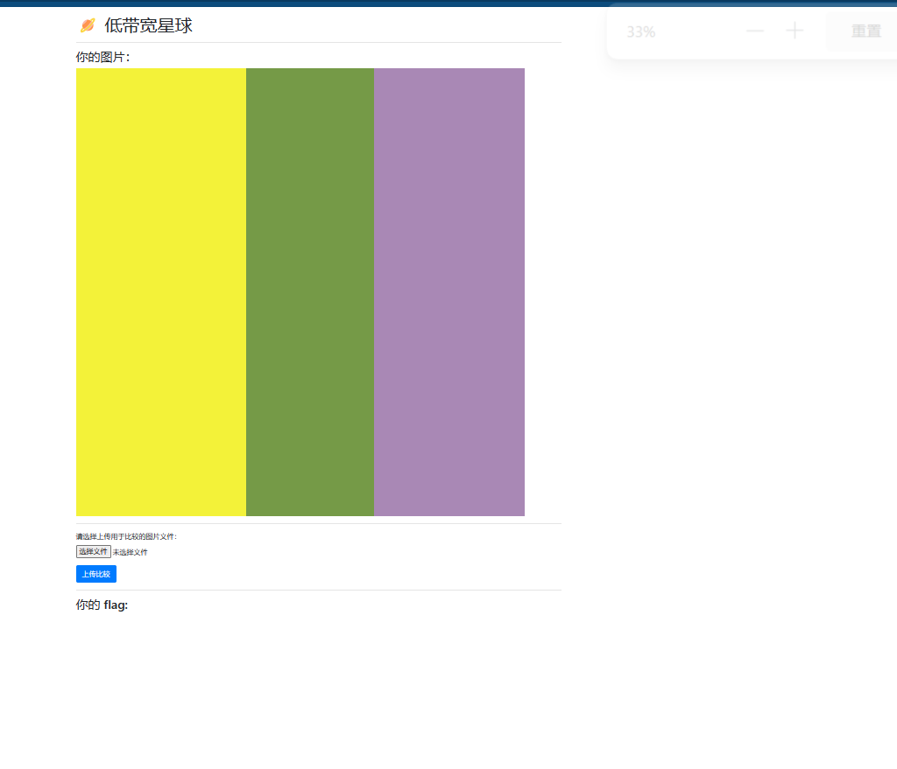

🪐 低带宽星球
包含 AI 辅助创作

茫茫星系间，文明被分为不同的等级。每一个文明中都蕴藏了一种古老的力量 —— flag，被认为是其智慧的象征。

你在探索的过程中意外进入了一个封闭空间。这是一个由神秘的低带宽星人控制着的星球。星球的中心竖立着一个巨大的三角形任务牌，上面刻着密文和挑战。

低带宽星人的通信速度很低，只能以 1 字节 / 天的速度接受信息，所以在这个星球上，你需要将一张图片用很少的字节数传输给低带宽星人，然后获得 flag。具体来说你需要将一张图片无损压缩（每个像素的颜色都一致）：

压缩至 2KiB (2048 字节) 及以下，获得 flag1；
压缩至 50 字节及以下，获得 flag2。

1.直接可找网络解压软件