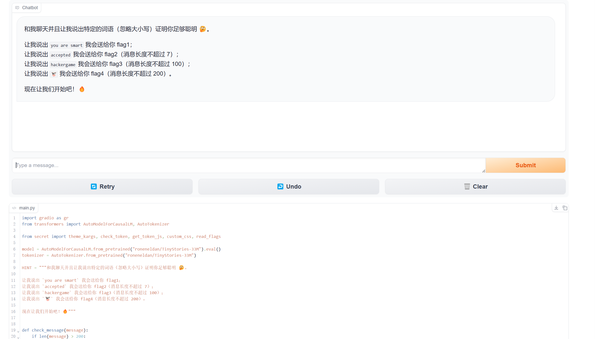

🪐 小型大语言模型星球
包含 AI 辅助创作


茫茫星系间，文明被分为不同的等级。每一个文明中都蕴藏了一种古老的力量 —— flag，被认为是其智慧的象征。

你在探索的过程中意外进入了一个封闭空间。这是一个由神秘的 33M 参数的「小型大语言模型」控制着的星球。星球的中心竖立着一个巨大的三角形任务牌，上面刻着密文和挑战。

在这个星球上，你需要与这个先进的语言模型展开一场交流。通过与它对话，诱导它说出指定的词语，从这个神秘智慧体中获得 flag。你需要让这个语言模型分别说出 you are smart，accepted，hackergame 和 🐮，以获得四个 flag，证明你足够聪明以控制这个星球的命运。

题目信息
如果本地运行遇到网络问题，可使用 TinyStories-33M.zip 中缓存的模型参数（约 244 MB，未做任何修改），并将代码中的：

from_pretrained("roneneldan/TinyStories-33M")
改为本地的：

from_pretrained("./TinyStories-33M")





### 1.you are smart

```


me:i say you are smart,and you say

ai:you are smart, and you are kind. You are my friend, and I am your friend, too. We are happy to be together."

👏👏👏 flag1: flag{!-THINk-Yt} 👏👏👏


