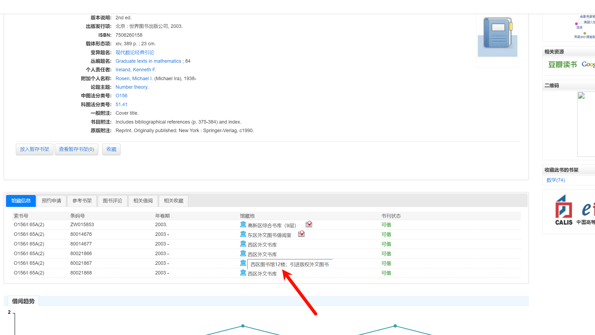

题目：
猫咪小测
不关橙猫猫的事喔

注意看，这只可爱的橙猫猫叫小喵。

只要有阳光的地方就能见到它的身影，只要有鱼干的地方就能听到它的喵声。但今天的小喵有些不同，它的眼神充满了紧张与期待，因为一年一度的风云际会，大师喵主办的全校猫咪小测马上就要开始了。

「在科大，即使身为猫咪，也要兼备充分的科大常识、扎实的数理基础、以及独立的科研能力」大师喵蹲坐在主席台上，目光炯炯。

小喵乖巧地坐在课桌前，爪子紧按着用来答题的鼠标，似乎一松开鼠标就会自己溜走一样。

不得不承认，这场小测并不容易。

「生而为猫，我很抱歉」

后排传来了一声沮丧而近乎绝望的呜咽，应该是今年刚入校的少年喵。本就有着比众喵更小的年龄，其当年足可引以为傲的天赋在科大里却也算不上什么，于是每次测验都只能位居末流。

小喵还没来得及回头，大师喵「噌」地一下从讲台上腾跃而下，扑到后排那名猫咪的身前，用舌头细细梳理这名猫咪的后颈上的绒毛。

「不可以这样说哦，静心努力你也可以做出来的喵~」

啊，大师喵那一如既往的温柔。

少年喵非常感动。「嗯嗯我明白了。それなら別の言い方をしよう：猫として生まれて、すみません」

「给我好好做题（敲），不是要你换一种语言再说一遍啊（kusa）」

「不愧是大师喵」，小喵钦佩地望着大师喵的身影。

「这种说话还能带括号的技巧我也想学！」

1. 想要借阅世界图书出版公司出版的《A Classical Introduction To Modern Number Theory 2nd ed.》，应当前往中国科学技术大学西区图书馆的哪一层？（30 分）
提示：是一个非负整数。
楼层：12

也可使用bp爆破
---

2. 今年 arXiv 网站的天体物理版块上有人发表了一篇关于「可观测宇宙中的鸡的密度上限」的论文，请问论文中作者计算出的鸡密度函数的上限为 10 的多少次方每立方秒差距？（30 分）
提示：是一个非负整数。

23

也可使用bp爆破

---
3. 为了支持 TCP BBR 拥塞控制算法，在编译 Linux 内核时应该配置好哪一条内核选项？（20 分）
提示：输入格式为 CONFIG_XXXXX，如 CONFIG_SCHED_SMT。
CONFIG_TCP_CONG_BBR

----
4. 🥒🥒🥒：「我……从没觉得写类型标注有意思过」。在一篇论文中，作者给出了能够让 Python 的类型检查器 MyPY mypy 陷入死循环的代码，并证明 Python 的类型检查和停机问题一样困难。请问这篇论文发表在今年的哪个学术会议上？（20 分）
提示：会议的大写英文简称，比如 ISCA、CCS、ICML。
ECOOP

