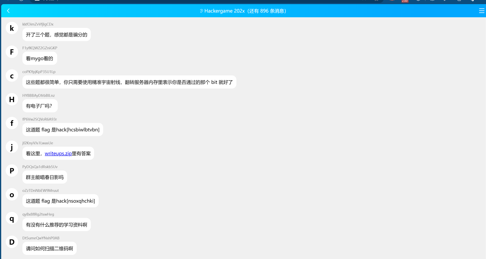

题目：

组委会模拟器
每年比赛，组委会的一项重要工作就是时刻盯着群，并且撤回其中有 flag 的消息。今年因为人手紧张，组委会的某名同学将这项工作外包给了你，你需要连续审查 1000 条消息，准确无误地撤回其中所有含 flag 的消息，并且不撤回任何不含 flag 的消息。

本题中，你需要撤回的 "flag" 的格式为 hack[...]，其中方括号内均为小写英文字母，点击消息即可撤回。你需要在 3 秒内撤回消息，否则撤回操作将失败。在全部消息显示完成后等待几秒，如果你撤回的消息完全正确（撤回了全部需要撤回的消息，并且未将不需要撤回的消息撤回），就能获得本题真正的 flag。





**编写脚本模拟点击**

```python
import requests
import json
import time

url = 'http://202.38.93.111:10021/api/getMessages'


cookies = {
    'session': 'f12查看'
}
headers = {
}
response = requests.post(url, headers=headers, cookies=cookies)

start = time.time()
time.sleep(0.5)
if response.status_code == 200:
    data = response.json()
    messages = data['messages']
    i=0
    for message in messages:
        # 判断是否符合flag格式
        if 'text' in message and 'hack[' in message['text'] and message['text'].endswith(']'):
            index =message['text'].index('[')+1
            flag = message['text'][index:-1]

            # //判断时间和数据的delay不可相差3ms
            print("\nindex:",i)
            print('delay',message['delay'])
            timedelay=time.time()-start
            print("time:",timedelay)
            if(message['delay']-timedelay>3):
                sleeptime =message['delay']-timedelay-1
                time.sleep(sleeptime if sleeptime>0 else 0)
            # //flag[小写字母]
            if flag.islower():
                message_id = i
                # time.sleep(0.11)
                # 发起删除数据请求
                delete_response = requests.post('http://202.38.93.111:10021/api/deleteMessage', json={'id': i}, headers=headers, cookies=cookies)
                if delete_response.status_code == 200:
                    print(delete_response.json())
                else:
                    break
        i=i+1

    if(i==1000):
        response = requests.post('http://202.38.93.111:10021/api/getflag',  headers=headers, cookies=cookies)
        data = response
        print(data.json())
else:
    print('Failed to retrieve messages.')


```