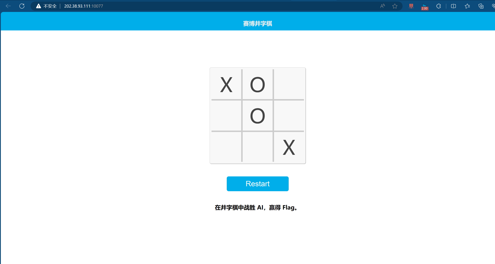
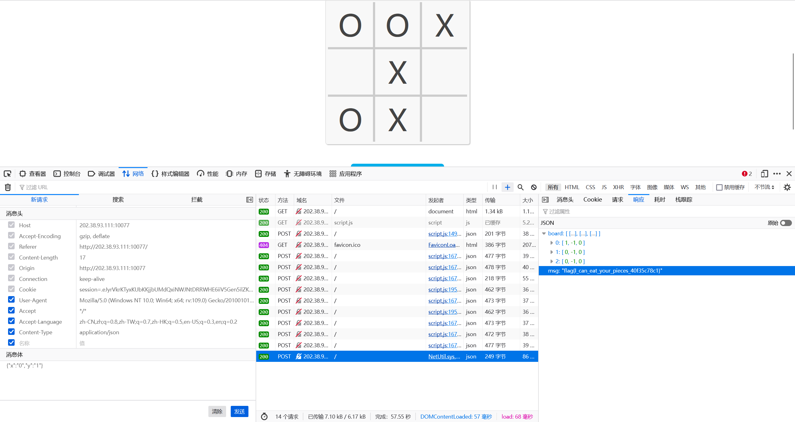

题目：
赛博井字棋
那一年的人机大战，是 AlphaGo 对阵柯洁，最终比分 3-0。当时我看见柯洁颓坐在椅子上泣不成声，这个画面我永生难忘。那一刻我在想，如果我能成为一名棋手，我一定要赢下人工智能。如今 AI 就在眼前，我必须考虑这会不会是我此生仅有的机会。重铸人类围棋荣光，我辈义不容辞！

……

但是围棋实在太难了，你决定先从井字棋开始练习。

使用bp抓包，将请求数据的第三个棋子的坐标填为对应的位子。也可以下完两步棋直接使用f12的开发者工具，进行数据包的重发（修改数据）。

