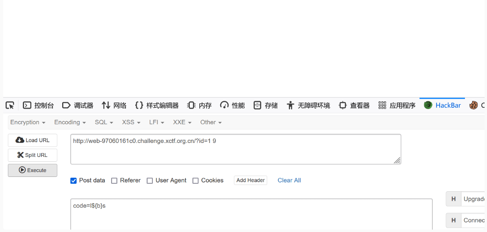

访问flag.php得到 然后在访问加密的代码.zip得到源码

```php

 
              <?php
              if (isset($_GET['id']) && floatval($_GET['id']) !== '1' && $_GET['id'] == 1) 
              {
                      echo 'welcome,admin';
                      $_SESSION['admin'] = True;
              } 
              else 
              {
                die('flag?');
              }
              ?>
 
              <?php
             if ($_SESSION['admin']) 
             {
               if(isset($_POST['code']))
               {
                       if(preg_match("/(ls|c|a|t| |f|i|n|d')/", $_POST['code'])==1)
                               echo 'no!';
                       elseif(preg_match("/[@#%^&*()|\/?><']/",$_POST['code'])==1)
                               echo 'no!';
                        else
                                system($_POST['code']);
               }
             }
             ?>
 ```

第一步id=1 9就能绕过 第二步l${b}s 可以绕过查看当前目录



访问7l8g得到lflag