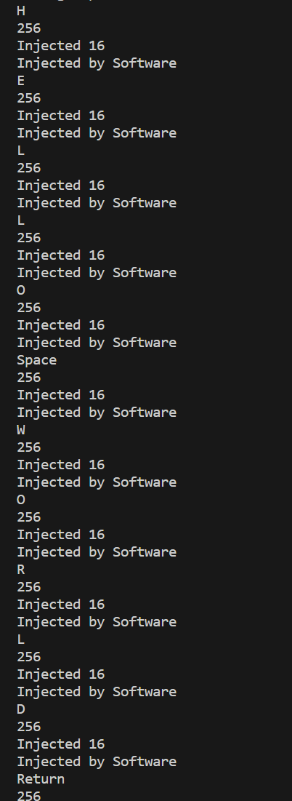
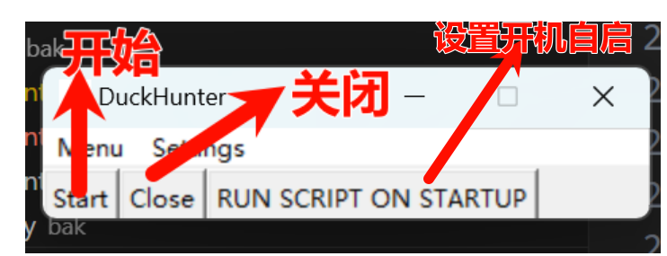
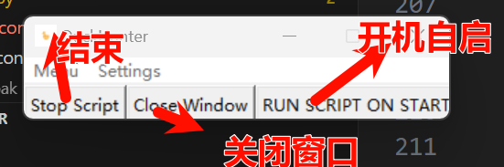
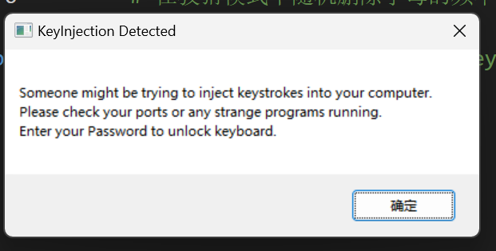
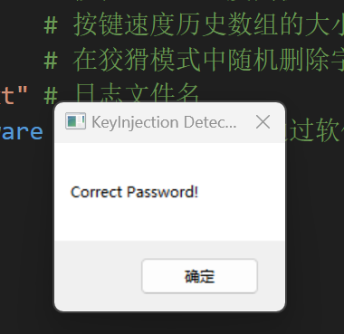

[Python tkinter教程-01：创建窗口_python创建一个400*500的大小主窗口-CSDN博客](https://blog.csdn.net/weixin_42725873/article/details/105622392)

[pywin32库 : Python 操作 windows 系统 API_python win32api-CSDN博客](https://blog.csdn.net/freeking101/article/details/88231952)

## 运行

需安装swig

[Python---PyHook3安装 - 知乎 (zhihu.com)](https://zhuanlan.zhihu.com/p/505983312#:~:text=Python---PyHook3安装 1 1.首先安装wheel依赖库 2 下载好将文件解压至任意文件夹，记住swigwin.exe 所在目录，配置 环境变量 ；,14.0 (如果本机有则忽略此步骤） 4 下载好后双击VisualCppBuildTools_Full.exe 默认安装即可。 5 4. 最后安装pyhook3)


## 模拟




输入脚本

```python
import pyautogui
import time

# 延时几秒，确保将焦点切换到命令行窗口（cmd）
time.sleep(3)

# 输入文本
text = "hello world"


# 循环遍历每个字符并模拟按键输入
for char in text:
    pyautogui.typewrite(char)
    time.sleep(0.1)

# 模拟按下回车键
pyautogui.press('enter')

```


​     


点击start后：



点击关闭窗口则命令行可见键入的事件


控制效果：Paranoid模式







## 其他

### dir_path = os.path.dirname(os.path.realpath(__file__))


在Python中，`os.path.realpath(__file__)` 和 `os.path.dirname()` 是两个与文件路径处理相关的函数。

1. **os.path.realpath(\*file\*)**：
   - 这个函数接收一个参数 `_file_`，在当前上下文中，`__file__` 是一个特殊变量，它代表了当前执行的 Python 脚本或模块的绝对路径。调用 `os.path.realpath(__file__)` 的目的是获取该脚本的“真实”或解析后的绝对路径。这个函数会解决所有符号链接（symlinks）并扩展相对路径，确保返回的是一个没有引用任何别名或相对路径的完整路径。
2. **os.path.dirname(path)**：
   - 这个函数用于从给定的 `path` 中提取目录部分，即去掉最后的文件名或者最后一级目录名，只留下路径本身。所以当它作用于 `os.path.realpath(__file__)` 返回的结果时，会得到包含当前执行脚本或模块的直接父目录的路径。

因此，组合起来：

```
python

dir_path = os.path.dirname(os.path.realpath(__file__))
```

这条语句的作用是获取当前执行脚本所在的目录的实际绝对路径。这对于在脚本中需要引用同一目录下其他文件或构建相对于脚本所在位置的路径等情况非常有用。